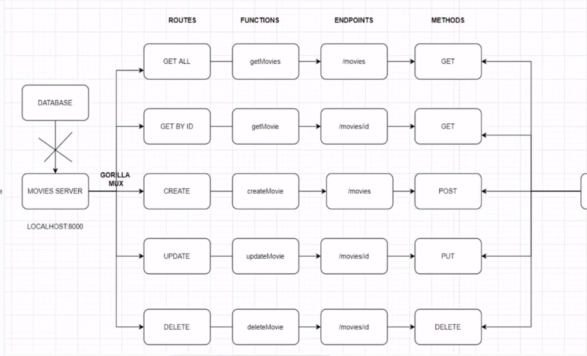

# Let's Go

## Info
This repo is made to track my progress and thoughts while building projects in Go. 

Go is syntactically similar to C, but with memory safety, garbage collection, structural typing, and CSP-style concurrency.
## Table of Contents
 - [Project 1: Go-server: Build a simple Web Server with Go](#project-1-build-a-simple-web-server-with-go)

- [Project 2: CRUD Movie API](#project-2-build-a-crud-api-with-go)

## Project 1. Build a simple web server with Go
### Basic Structure:
>               --> / --> index.html
>       Server  --> /hello  --> hello func
>               --> /form --> form func --> form.html


## Project 2. Build a CRUD API with Go

Structure of the API:


### Install gorilla/mux:

```
go get -u "github.com/gorilla/mux"
```
 It is syntactically similar to C, but with memory safety, garbage collection, structural typing, and CSP-style concurrency.
### The packages that we will use in this projects include:
    - "encoding/json" //data in json and sent to postman
	- "fmt"
	- "log" 
	- "math/rand"
	- "net/http" //create a server in golang
	- "strconv"  //string converter
	- "github.com/gorilla/mux"
### Design 2 Endpoints: /movies and /movies/id

### struct is an objecct in javascript with key-value pairs 
Here, the movie struct and director struct will be associated such that every movie will have one director. 

Everything would be in json form. 

There would be 2 properties within the director struct: 2 strings each represent the director's first name and last name:

    - Director struct object's fields:
        - Firstname string `json:"firstname"`
	    - Lastname  string `json: "lastname"`

There would be 4 properties within the movie struct: 3 Strings and 1 Director struct that we just made above:

    - Movie Struct object's fields:
	    - ID    string `json:"id"`
	    - Isbn  string `json:"isbn"`
	    - Title string `json:"title"`
	    - Director *Director `json:"director"`
### Movies array (an array of Movie struct!)
```go
var movies []Movie
```
### Functions that we use to CRUD (Create, read, update, and delete):

### getMovies function
This function will return the movie with the id specified.
```go
func getMovies(w http.ResponseWriter, r *http.Request) {
	w.Header().Set("Content-Type", "application/json")
	json.NewEncoder(w).Encode(movies)
}
```
First, we have to set the content-type header to "application/json" so clients know to expect json!
```GO
    w.Header().Set("Content-Type", "application/json")
```
Write JSON to the server:
```go
    json.NewEncoder(w).Encode(movies)
```
### getMovie function

As always, we first need to set the content-type to json files so as to let the clients know to expect json!
```GO
    w.Header().Set("Content-Type", "application/json")
```
The names are used to create a map of route variables which can be retrieved calling mux.Vars():

```go
    params := mux.Vars(r)
```
We loop through the movies, and for each Movie struct, we check if the ID field equals the id field of param. 
```GO
    for _, item := range movies {
		if item.ID == params["id"] {
			json.NewEncoder(w).Encode(item)
			return
		}
	}
```
### createMovie function
```GO
func createMovie(w http.ResponseWriter, r *http.Request) {
	w.Header().Set("Content-Type", "application/json")
	var movie Movie
	_ = json.NewDecoder(r.Body).Decode(&movie)
	movie.ID = strconv.Itoa(rand.Intn(100000000))
	movies = append(movies, movie)
	json.NewEncoder(w).Encode(movie)
}
```

### updateMovie function
```GO
func updateMovie(w http.ResponseWriter, r *http.Request) {
	//set json content type
	w.Header().Set("Content-Type", "application/json")
	//params
	params := mux.Vars(r)
	//loop over the movies, range
	//delete the movie with the i.d that you've sent
	//add a new movie - the movie that we send in the body of the postman
	for index, item := range movies {
		if item.ID == params["id"] {
			movies = append(movies[:index], movies[index+1:]...)
			var movie Movie
			_ = json.NewDecoder(r.Body).Decode(&movie)
			movie.ID = params["id"]
			movies = append(movies, movie)
			json.NewEncoder(w).Encode(movie)
			return
		}
	}
}
```

### deleteMovies function
```go
func deleteMovie(w http.ResponseWriter, r *http.Request) {
	w.Header().Set("Content-Type", "application/json")
	params := mux.Vars(r)
	for index, item := range movies {
		if item.ID == params["id"] {
			//take that index, and take all the data
			movies = append(movies[:index], movies[index+1:]...)
			break
		}
	}
	json.NewEncoder(w).Encode(movies)
}
```
### main function
Structure: 
1) mux.NewRouter()

2) append two new movie objects into the movies array we built.
```go
movies = append(movies, Movie{ID: "1", Isbn: "438227", Title: "Movie One", Director: &Director{Firstname: "John", Lastname: "Doe"}})
```
> **Note:**  append(arrayname, item)
> each object of the struct: 
> 

3) 5 differenet routes specified:
    - getMovies - "GET"
    - getMovie - "GET"
    - createMovie - "POST"
    - updateMovie - "PUT"
    - deleteMovie - "DELETE"

**Note:** How to?

Here we register three routes mapping URL paths to handlers. 
> This is equivalent to how http.HandleFunc() works: 

> if an incoming request URL matches one of the paths, the corresponding handler is called passing ```(http.ResponseWriter, *http.Request)``` as parameters.

Paths can have variables. They are defined using the format {name} or {name:pattern}. If a regular expression pattern is not defined, the matched variable will be anything until the next slash.

For example:

```go
r := mux.NewRouter()
r.HandleFunc("/products/{key}", ProductHandler)
r.HandleFunc("/articles/{category}/", ArticlesCategoryHandler)
r.HandleFunc("/articles/{category}/{id:[0-9]+}", ArticleHandler)
```

Here we use HandleFunc, and added another match:
```Go
	r.HandleFunc("/movies", getMovies).Methods("GET")
```

4) Print on screen that the server is starting at port 8000.
```GO
	fmt.Printf("Starting server at port 8000\n")
```
5) 


### Testing THE API in Postman.
